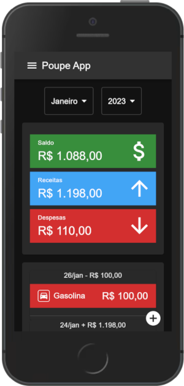

# Poupe App

Aplicação Web para controle financeiro pessoal



## Tecnologias

- [React](https://pt-br.reactjs.org/)
- [MUI Design](https://mui.com/)
- [TypeScript](https://www.typescriptlang.org/)
- [Firebase](https://firebase.google.com/)

## Como Utilizar 

Acesse https://poupeapp.netlify.app/, crie uma nova conta ou entre com:

```
teste@teste.com
123456
```
